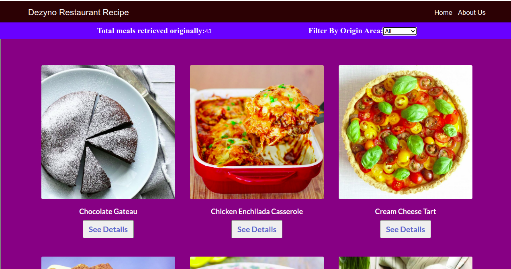
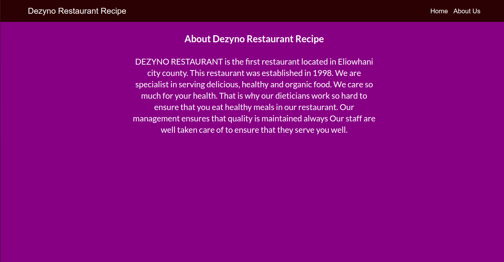
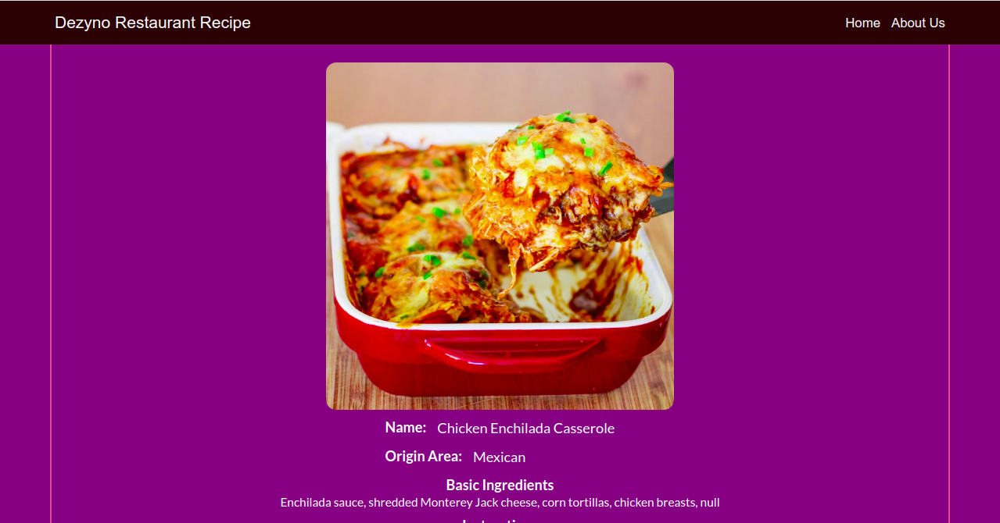
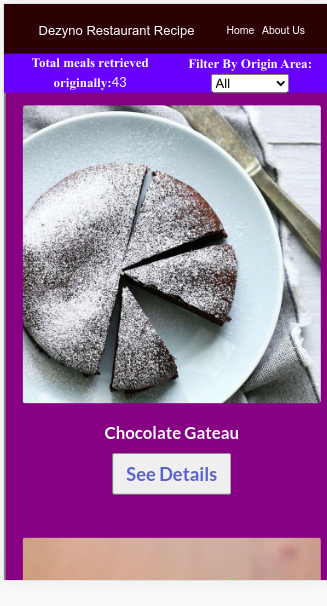

# Meal Catalogue App
This is a single-page application (SPA) built with react and redux. The main function of this application is to display a catalog of different meals that can be served in any restaurant. It allows customers to see details of each meal and to make a decision whether to buy or not. The application pulls the information about the meals from The mealDB API. The list of meals on display can be filtered using the meal origin area (country of origin of the meal). Detailed information about each meal can be seen by clicking on the See Details button below each meal. This will display further information about each meal including name, origin area, basic ingredients, and instruction on how to prepare the meal. You can also view information about this restaurant by clicking on the About Us tab on the navigation bar. You can go back to the home page by clicking the Home tab or the name of the application. This application is fully responsive.

## Main Features
- User Can list meals from different countries
- User can filter the list based on meals origin area (country of origin).
- User can see details of each meal.

## Preview

## Home Page


## About Page


## Detail Page


## Mobile View


## Project SetUp
Get a local copy of the file. Clone with HTTPS following the steps below.

### For Windows
- In your search box, type cmd, click on cmd to open the command prompt.

### For Linux, Mac OS
- In your search box, type terminal, click on the terminal to launch it.

- Copy and paste the command below in your terminal and press enter from your keyboard.
```
git clone https://github.com/Zubenna/meal-catalogue-app.git
```
## Access Project Folder 
- Depending on where the project files are downloaded to, either Hard Disk(HDD), Desktop or Documents directory in your computer after completing the step above.
- Double click on the folder meal-catalogue-app to open it.
- Inside the folder, right-click and click on terminal or cmd depending on your Operating System to open it.

## Set Up Project Locally in Your Computer
- In the cmd or terminal, type the command below;
```
npm install
```
- Wait for some time to install all the app packages and dependencies.
- Once the installation is completed.
- Type the command below in your cmd or terminal to start the project locally. Wait for some time.
```
npm start
```
- Once the server is fully started, you will see the project opening a different tab on your browser at port http://localhost:3000/. The page now displays the Dezyno Restaurant Recipe app. You can navigate through the Dezyno Restaurant Recipe now.


## Live Version
Launch live version.
- [Launch App]()

## Built With (Packages and tools)
- React
- JavaScript
- React-DOM
- React-Create-App
- Redux
- npm
- [themealDB API](https://www.themealdb.com/api.php)
- Axios
- PropTypes
- ES6
- Jest
- Enzyme
- CSS modules
- React Testing Library
- Eslint
- Stylelint
- VScode

## Author
👤 **Nnamdi Emelu**
- Github: [zubenna](https://github.com/zubenna)
- Twitter: [@zubenna](https://twitter.com/zubenna)
- Linkedin: [nnamdi-emelu](https://www.linkedin.com/in/nnamdi-emelu/)

## 🤝 Contributing
Contributions, issues, and feature requests are welcome!
Feel free to check the [issues page](https://github.com/Zubenna/meal-catalogue-app/issues/new)

## 👍 Show Your Support
Kindly star ⭐️ this project, if you like it!
 Denys Chagaida on Behance
## :clap: Acknowledgements
- Denys Chagaida on Behance - For UI Design inspiration.
- [Microverse](https://www.microverse.org/)

## 📝 License
This project is [MIT](LICENSE) licensed.
